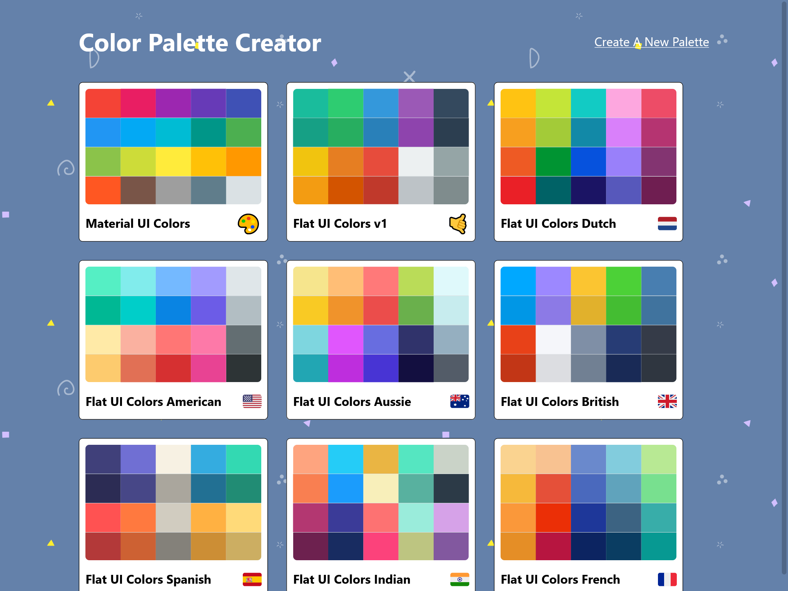
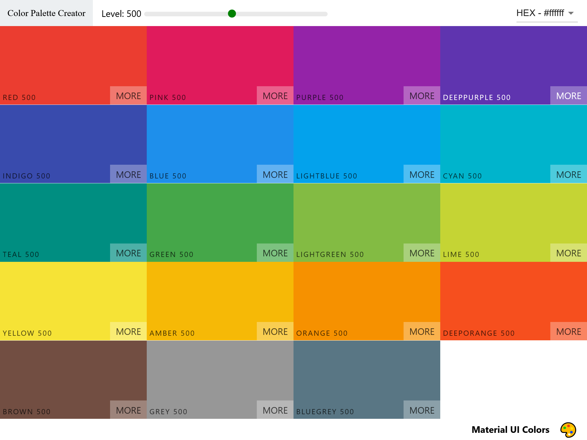
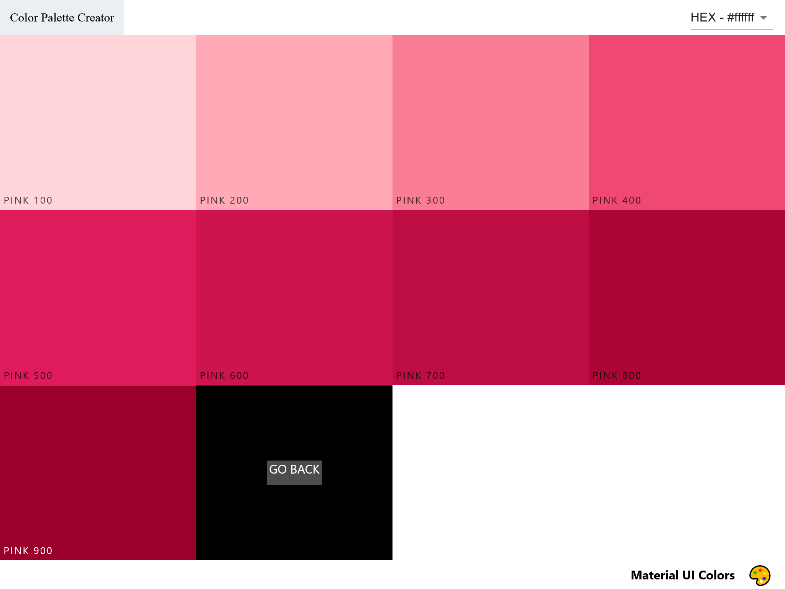
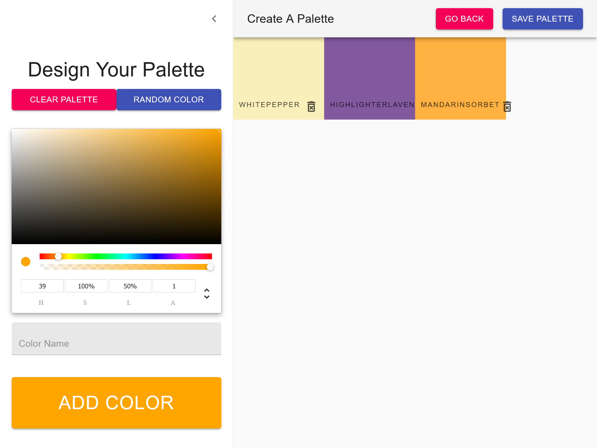
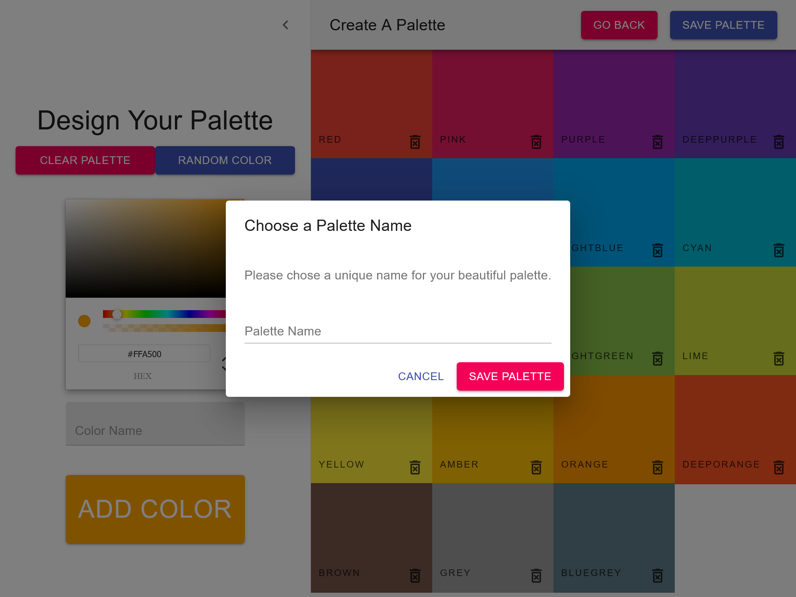
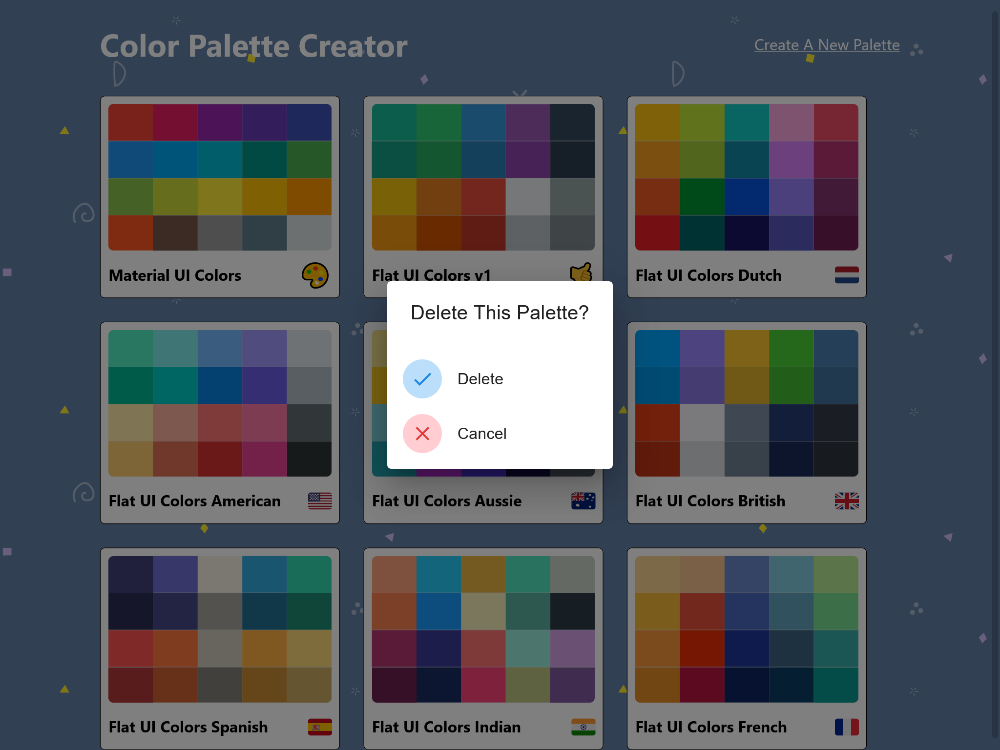

# Color Palette Creator

Color Palette Creator is a convenient tool for design. It can be used to put together a quick custom color palette to use directly in a project or for inspiration. 
The main usage case is for quickly copying a color to the clipboard. Local storage is used to persist the palettes.

---

### ScreenShots
#### Homepage

#### Selected Palette

#### Selected Color

#### Copy to clipboard

#### Color palette creation



#### Delete a color palette


---

### Patterns

* Class Based Stateful Components

* Local Storage
---

### Technologies

* React.Js

* Material UI

---

### Working Example 

[Colors](https://z-colors.hellojjwj.com)

---

### Local install

```
git clone https://github.com/JJWJ/react-Colors_App.git
```
`npm start` or `yarn start`
Runs the app on localhost:3000


